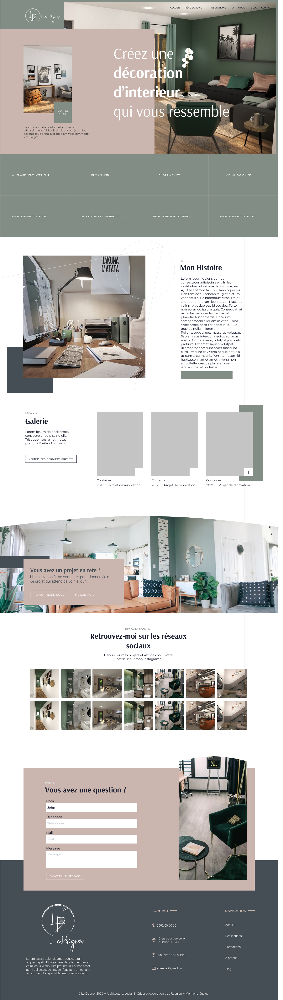
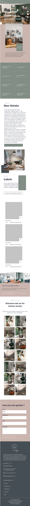

# MDS-LandingPage
Ce projet à pour but de me faire travailler l'intégration web en html et sass.

Prof du TP: **Loîc VANDERSCHOOTEN**

Objectif réalisé landing page basé sur le maquette réalisé en figma.

## Outils et réalisation technique
Développement en HTML et SASS avec compilation du code avec "watch sass"

Utilisation de VSCode avec l'extention "Go Live" pour intégréer en live et facilité le développement

## Maquette a réaliser

